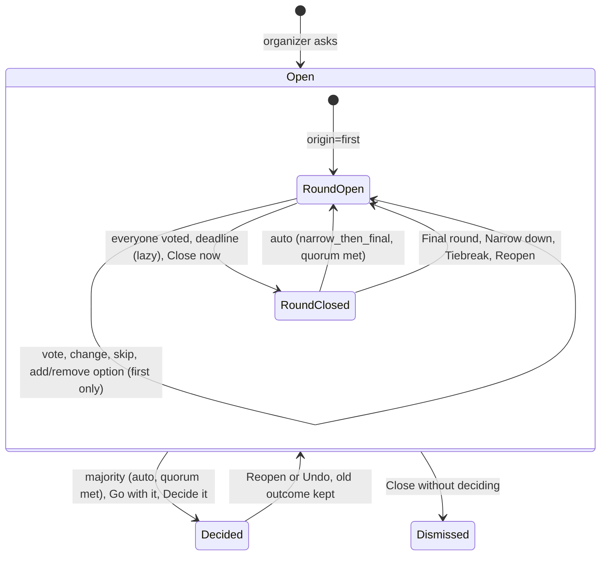
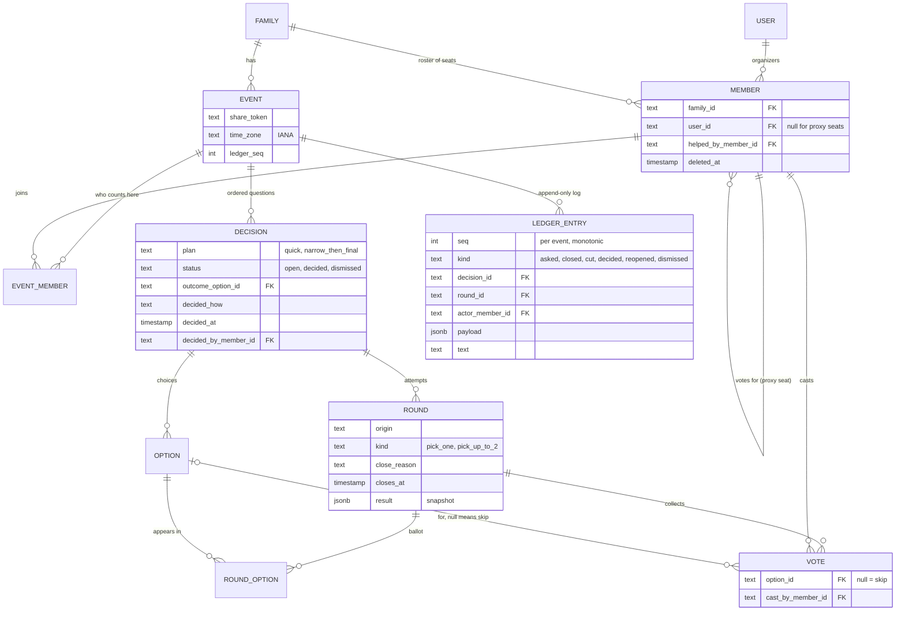

<!-- Generated 2026-09-05 from a brainstorm workflow: four independent concept directions
(simplest-thing-that-works, the family's lived experience, the decision engine, the event as
container) plus a landscape scan of existing tools; each concept was critiqued by a family-usability
skeptic and an engineering-feasibility skeptic; the strongest spine was synthesized, gap-checked
(18 gaps), and revised. Supporting material is in BRAINSTORM-APPENDIX.md. -->

> **How this relates to the code in this repo.** The app follows the founder's requirement that
> everyone signs in with Google, Apple or Facebook, so every vote is accountable to a person; kids
> and relatives without accounts get proxy seats an adult votes from. This brief argued for a
> different identity model (voters tap their name from a roster with no sign-in) because Messenger's
> in-app browser can break OAuth flows. **Decision, 5 Sep 2026: sign-in stays required.** The
> Messenger-webview risk is real and is handled in the sign-in page copy instead. Everything else
> here (events, rounds, the record, sharing back to Messenger) is consistent with the app and
> refines it.

# FamPoll product brief

## Vision

FamPoll is one link per trip, pasted into the Messenger thread the family already has. The link opens an event (a trip, a weekend, Friday dinner) that holds every question about it, lets everyone vote after one social sign-in, narrows a crowded field with a second round when the first does not settle it, and keeps a "decided so far" list that goes back into the chat as text. The arguing stays in Messenger; the tally and the record move out. Spine: accountable seats (everyone signs in once; kids get proxy seats an adult votes from); two round kinds; one log.

1. FamPoll: "Family votes, round by round." Ship under it.
2. Show of Hands: "Ask the family. Settle it. Remember it." The pick if renaming.
3. Whittle: "Narrow it down, together." Names the mechanic.

## Who it is for

The founder's family: two parents, kids of mixed ages, relatives in one Messenger thread. Six people, not sixty.

- Shai, organizer parent: creates the event, pastes the link, runs rounds. Needs 30-second setup, who has not voted at a glance, one tap to move on.
- Co-parent, co-organizer: closes or decides when Shai is busy.
- Kid with a device (about 11): signs in with their own Google or Apple account, adds "what about sushi".
- Kid without a device (about 8): a parent votes for them, recorded under the kid's name, "helped by".
- Grandparent on Messenger: taps the invite link, signs in with Facebook once, votes. No install, no password.
- Occasional relative: gets the invite link, signs in, votes; an organizer removes them afterwards.

## The core loop

1. Shai creates "Fall break 2026" (title, optional dates, who counts here), taps Share, and the event link fampoll.app/e/<token> lands in Messenger with a text preview: the only link the family ever sees.
2. A new person taps the invite link, sees who invited them, signs in with Google, Apple or Facebook, and joins in one tap. Anyone already signed in lands on the event.
3. Shai asks a question: title, options one per line, deadline chip, plan (Quick vote or Narrow down, then final).
4. Everyone taps an option; the card shows live counts, avatars, "4 of 6 in, waiting on Nana, Eli", and a New option badge when a kid adds sushi. A parent flips "Also vote for Eli" and taps again.
5. The round closes when everyone has voted, at the deadline, or on Close now. A majority with half the roster in decides itself; otherwise the organizer gets one tap: Final round with the top 2, Go with the leader, or on a tie Tiebreak or Decide it.
6. The outcome moves to "Decided so far" at the top of the event, with Undo for ten minutes; Shai taps Copy for Messenger: "Friday dinner: Taco Palace (round 2, 4-2)".

## Concepts and vocabulary

- Family: the standing roster of seats. UI word: People.
- Event: title, optional dates, time zone, ordered decisions, a pinned roster, one share link. UI word: Trip.
- Decision: one question with a plan, at most one open round, status open, decided, or dismissed. UI word: Question.
- Round: one pass of voting with a deadline, an origin, and a ballot that is append-only while open and frozen at close. Votes never carry across rounds.
- Option: a plain-text choice; alive in a round only if on its ballot.
- Vote: one seat's tap in one round (one option, up to two when narrowing, or Skip), changeable until close, attributed to the seat and to whoever cast it.
- Outcome: what a decision settled on, how, when, by whom. decisions.outcome_option_id is the current pointer; the ledger row of kind=decided is the immutable history, superseded by a reopen, never edited.

## Rounds model

Kinds and plans. Pick one and Pick up to 2 (taps toggle, no submit). Skip is a ballot with no option; it counts toward everyone-voted only. Plans: Quick vote (one pick-one round) and Narrow down, then final (pick-up-to-2, then pick-one; skipped below four options).

Origins, not steps. A round has an origin (first, narrow, final, tiebreak, reopen), a kind, and a close_reason (everyone, deadline, closed_now); the badge reads "Round 2" or "Tiebreak", never "of N". A final is the last voted round of its decision: with no majority, only Go with the leader and Decide it remain. Tiebreak opens once per decision. Closed is terminal. Only event organizers (plural) advance a decision.

Options. Any seat may add an option only while the origin=first round is open (append-only; earlier voters see "New option: sushi"); organizers can Remove option while open, logged.

Deadlines and the vote write. closes_at (Tonight, 1 day default, 3 days) is in the event's zone; any read settles due rounds with a conditional update; no scheduler. The vote action is one transaction: SELECT the round FOR UPDATE; assert open and closes_at > now; assert the option is on round_options; pick-one and Skip replace the seat's rows, pick-up-to-2 toggles one row with a cap of two; count distinct voters against current event_members and close in the same transaction when everyone is in. Unique index (round_id, member_id, option_id) NULLS NOT DISTINCT (Neon supports it); a partial unique index allows one open round per decision; closed rounds store a result snapshot. Extend is v1; Reopen for 1 day covers a missed deadline.

Everyone, quorum, skip. "Everyone" is the current non-deleted event_members set at evaluation time; a seat removed mid-round drops its ballot, logged. Quorum: at least half the roster in with non-skip ballots; majority is over non-skip ballots. Roster 6, 3 skip, 2 A, 1 B: quorum met, A decided. Quorum guards every automatic outcome; below it the round waits.

Close outcomes (pure engine function):

- Pick-one, majority, quorum met: decided.
- Pick-one, plurality: "Final round: A vs B" (top 2 plus ties, fresh ballots), "Go with A", "Narrow down" (engine's cut pre-checked, adjustable, never disabled), "Close without deciding".
- Pick-one, tie: "Tiebreak round" (tied options only), "Decide it: A / B" (logged "Shai decided, 3-3 tie"). After a tiebreak or a final: Go with it and Decide it only.
- Pick-up-to-2, quorum met: drop zero-approval options, keep the top 2 plus ties, auto-open the final ("Round 2. Cut: sushi, Thai. Vote again"). A sole survivor approved by half the voters is decided directly.
- Below quorum, any kind: "Only 2 of 6 voted": Reopen for 1 day, Go with it (pick-one) or Narrow down with an adjustable cut (pick-up-to-2), Close without deciding.
- All skip or zero ballots: Reopen for 1 day, Decide it, Close without deciding; never Go with it, there is no leader.

Reopening. Reopen targets only the latest round, only when none is open, and opens a new round (origin=reopen, same ballot, deadline reset) with no ballots copied: copies would auto-close it and re-decide the same thing. The old outcome stays in the ledger as "was Taco Palace, reopened by Shai". Reopen shows as Undo for ten minutes.

Engine tests: 3-2-0-0-0-0, 2-1-1-1, 2-2-1, all-zero, n = 2, 3 skips plus 2-1, all skip, 1 of 6 in a narrow round, zero votes in a narrow round, reopen after a 4-2 majority does not auto-close, a final at 2-2 offers no further round.

## Features by tier

MVP (four weekends, with the v1 cuts):

- Sign-in with Google, Apple or Facebook for everyone (Clerk): requirement 4, and every vote is accountable to a person.
- Family roster with one invite link that can be rotated; proxy seats for kids and relatives without accounts, created by organizers and voted from an adult's screen.
- Event with title, dates, time zone, pinned roster, ordered decisions, one share link; Ask sheet with title, options, deadline chip, plan toggle: requirement 1.
- Pick-one and pick-up-to-2 rounds, changeable votes, Skip, add and remove option: requirement 3.
- Close on everyone-voted, deadline, or Close now; auto-decide on majority above quorum.
- Organizer actions (Final round, Go with it, Narrow down, Tiebreak, Decide it, Reopen for 1 day, Undo, Close without deciding), logged.
- "Also vote for Eli" proxy with helped-by attribution; last write wins, both logged.
- Decided-so-far header, plain-words ledger, Copy for Messenger on every round and the event: requirement 2.
- Text-only OG card on the event link with ?v=<ledger_seq> so Messenger's cache is never stale.

v1 (cut from MVP to make four weekends honest):

- Flip a coin with a stored seed (Decide it covers ties until then); Extend; link rotation; the second-parent proxy conflict prompt; the open-in-browser interstitial; 10-second polling (MVP is refetch on focus plus Refresh); the next/og image with an "as of" stamp.
- Organizer-only email reminder ("2 hours left, waiting on Nana, Eli") via an external 15-minute ping.
- Hide votes until close; claim a seat with a social login across devices.
- Public no-names /s/ summary, if question 9 says yes.
- Date-range options with a people-by-dates grid; edit a question for 15 minutes; archive.

Later:

- Facebook Login in production: Live mode, a data-deletion callback and possibly business verification. A Clerk development instance needs none of that.
- Sign in with Apple in production: needs an Apple Developer membership and custom credentials; the development instance uses Clerk's shared ones.
- Web push; ranked-choice finals; Messenger bot; native wrappers.

## Login and onboarding

Everyone signs in, once, with Google, Apple or Facebook through Clerk. That is the founder's requirement and it is what makes every vote accountable to a person. In a Clerk development instance all three providers work on Clerk's shared credentials, so nobody needs a Google Cloud, Apple Developer or Meta account to try the app; production needs the family's own provider credentials. No passwords, no magic links, no PINs.

The organizer creates the family and shares one invite link. A person who taps it sees who invited them and how many people are in, signs in, and joins in one tap. Organizers can rotate the link (the old one stops working) and remove people; one family per account for now.

Kids and relatives without an account are proxy seats: a first name, created by an organizer, voted from that adult's screen ("Voting for Eli"), stored as member = Eli with cast_by = the adult, and counted like everyone else. Up to four per organizer, unique names, so a seat can never quietly become a second vote.

Messenger's in-app browser can break Google or Facebook OAuth. The sign-in page detects the FBAN, FBAV, FB_IAB, Messenger and Instagram user agents and shows one line, "Sign-in works best in your browser", with an Open in browser action; the invite link survives that round trip. Errors are plain: "This closed at 8pm", "This link is no longer valid, ask for a new one".

## Keeping track along the way

Notifications: the app sends nothing to family members in MVP. Every open round and close has Copy for Messenger ("Vote by 8pm ET: link", "Still waiting on Nana and Eli: link", "Decided: Taco Palace, 4-2"), and who has not voted sits on the card. Copy renders the text in a visible textarea that selects all on tap, attempts the clipboard, and shows "Copied" only on success, because the clipboard API is unreliable in Facebook's iOS webview.

Times: the event stores the organizer's IANA zone from the browser at creation; deadlines render in that zone with its abbreviation plus a relative "in 3 hours".

Decision log: an append-only ledger in plain words ("Cut: sushi, Thai", "Shai decided, 3-3 tie", "Reopened by Shai, was Taco Palace"). Each decided card shows its losers struck through; the lines sit under it for the rare expand.

Event summary: the event header is the receipt, rendered as "title: outcome" ("Where? Lisbon. How many nights? 5. Friday dinner: Taco Palace"), so the Ask sheet nudges short titles; nothing is derived from dates. Copy as text adds open items with deadlines.

Sharing back: Messenger caches the preview at first paste, so every share appends ?v=<events.ledger_seq>; og:title and og:description come from the same data ("Fall break 2026: 3 of 5 decided, Friday dinner closes Sun 8pm").

## Data model

Twelve tables replacing the scaffold's nine; event_members is the pinned roster, round_options the append-only ballot, ledger_entries the history. Tallies come from votes while open and rounds.result after close.

## Screen inventory

Mobile-first at 390px, paper ground (#FAF6F0), Figtree at a 20px base in rem, orange (#E4702E) for "needs you", teal (#1D9A85) for "decided", 64px targets. The design canvas holds Login, Home, Main, Vote, RoundResults, NewDecision, and Summary (screens 2 to 8), drawn for the sign-in model that was chosen; screens 9 and 10 are undesigned.

1. Invite landing and sign-in. "Dana invited you to Summer '27 Trip, 5 people in"; Continue with Google, Apple, Facebook; "No passwords. We only keep your name and photo so the family knows who voted"; the in-app-browser hint.

2. Sign-in without an invite. The same three buttons for someone who arrives at the front door; then "Start a family" or "Have an invite code?".

3. Home. Needs your vote list; event cards ("3 of 5 decided, 1 open"); New event; People; past events.

4. Event page. Title, dates, "6 people" chip opening screen 10; receipt header; Share; Open now: question cards with round badge, options with counts and avatars, New option badge, "4 of 6 in, waiting on Nana, Eli", an organizer row Close now / Remove option / Dismiss while open, the close actions when closed; Decided: one line per question, losers struck through, Undo for ten minutes; floating Ask; Refresh.

5. Vote (ballot). "Voting as Nana. Not you?"; question in large type; rule sentence; round-2 card ("Round 2. Cut: sushi, Thai. Vote again"); full-width option cards with live count and avatars; Add an option (first round only); Skip; "Also vote for Eli" toggle; done state "Got it, Nana. 4 of 6 in. You're done, close this tab".

6. Round closed (organizer results). Close reason in plain words ("Everyone voted, so it closed early", "Only 2 of 6 voted"); tally bars with avatars; the state-dependent actions, each previewing its ledger line; Copy for Messenger.

7. Ask a question (sheet). Title with placeholder "Where? / How many nights?"; options textarea that splits pasted lines; chips Tonight / 1 day / 3 days; plan toggle; "Ask and copy for Messenger".

8. Event link preview and text summary. og:title and og:description from the ledger with ?v=; Copy as text.

9. People (roster sheet). Everyone with a role chip (organizer, proxy voted by Shai); the invite link with Share, Copy and Make a new link; add a proxy seat; Make organizer; remove.

10. New / edit event (sheet). Title; optional dates; "Who counts here" toggles over the roster, all on by default; Create, then Share.

## Recommended stack

Keep the scaffold's frame: Next.js 16 App Router, TypeScript, Server Actions on Vercel Hobby; Clerk 7 for everyone's sign-in; Postgres on Neon via Drizzle and the postgres.js driver over the pooled endpoint in the Node runtime, because the vote write needs a row lock and neon-http has no transactions; Tailwind 4; the pure engine in src/lib/engine/rounds.ts with the tests above; lazy settlement in lifecycle.ts; refetch on focus plus Refresh, no polling, no realtime, no cron.

Keep the scaffold's identity as built: every voter is a Clerk user, organizers create proxy seats, one invite link per family. The delta from the scaffold is the engine and its vocabulary: two round kinds instead of ideas, shortlist and final; Skip ballots; quorum before any automatic outcome; an append-only ledger with sequence numbers for the share preview; per-event rosters; event time zones. Schema: add event_members, round_options and ledger_entries (replacing activity); events.time_zone and ledger_seq; decisions.decided_by_member_id and decided_how; rounds.origin and result; votes.option_id nullable for Skip. That is three to four weekends on the scaffold.

Cost: $0 a month; a domain at about $12 a year; Apple Developer $99 a year only if a wrapper ships. Neon suspends after five idle minutes; a skeleton ballot covers the first tap.

## Risks and mitigations

- Messenger gravity: if the link is not pasted into the thread within a week, the product is not working. Copy for Messenger is the primary action everywhere.
- Messenger's in-app browser can break OAuth: the sign-in page detects it and offers Open in browser, and the invite link survives the round trip. A forwarded invite link only ever creates a named, removable member, never a second vote for someone.
- Tiny electorates tie constantly: zero-vote options drop first, ties at the cut advance, one tiebreak then a human tap.
- Wrong outcomes on the ledger: quorum before any automatic outcome, Undo for ten minutes, outcomes superseded not mutated, no ballot copying on Reopen.
- Two parents proxy the same kid: last write wins, both logged; the conflict prompt is v1.
- Link leaks and COPPA: soft-delete seats, no names in any preview, kid seats hold a first name and an emoji.
- Scope creep toward itineraries and un-cutting v1 items: the four-weekend budget.

## Open questions for the founder

1. The real roster: who has Google, who is iPhone-only without Gmail, which kids have devices.
2. Resolved 5 Sep 2026: everyone signs in with a social account. Still open: is anyone in the family without all three of Google, Apple and Facebook? They would need a proxy seat.
3. Do both parents organize? Confirms co-organizers in MVP.
4. Live votes by name, as in Messenger, or hidden until close as the default?
5. Should "pick up to 2" be round 1 whenever there are four or more options, or on demand only?
6. Is Friday dinner one standing event or a fresh one each time?
7. Do kids' votes count equally on money questions, or is an adults-only toggle needed?
8. Name: FamPoll, Show of Hands, or Whittle?
9. Is a public summary page showing outcomes without names acceptable, or text-only forever?

## Deliberately not building

- Trip planning: itineraries, budgets, bookings, packing lists, maps.
- Comments and idea threads: Messenger does this.
- A separate Ideas round: Add an option during the first round replaces it.
- A family-level link: every link is an event link.
- Ranked choice, score voting, vetoes, vote weights; the only override is a logged Decide it.
- Dependencies that lock questions; roles beyond organizer and voter.
- Notifications to family members, per-vote pings, web push, SMS.
- A no-account voting path (tap-your-name seats, guest seats, personal links), magic links, passkeys, kid PINs.
- Realtime infrastructure, polling, cron, native apps, a Messenger bot, calendar export.
- Anonymous-by-default voting, recap photos, templates, streak counters.
